<p align="center">
  
</p>

<h1 align="center">Cookie Dumper</h1>

A **token-gated localhost API** that serves your browser's live cookies for
**any site you ask for, on demand** — as **dotenv-shaped text, JSON, or shell
`export`s**. Nothing is written to disk. Built for debugging your own apps: pull a
live session token straight into your tool without leaving secrets lying around in
files.

<p align="center">
  
</p>

It does the thing you (rightly) wouldn't trust a random store extension to do —
read your `HttpOnly` session cookies — so it's deliberately small, dependency-free,
and readable end to end. Read it, then trust it.

## Why this shape

The only thing that can read cookies is the **extension** (`chrome.cookies` —
cross-platform, no DB decryption, no keyring). A Chrome service worker can't host
a server, so the **native host** (plain Node, spawned by Chrome) does double duty:
it bridges the extension over the native-messaging port *and* binds a `127.0.0.1`
HTTP server. The **CLI** and your app are just HTTP clients.

```
your app / curl ──HTTP + bearer token──►┐
cookiedumper CLI ─HTTP + bearer token──►│ native host (127.0.0.1:8787)  ──native msg──► extension SW
                                         │   GET /env?site=app.example.com&format=json   (relays)   reads cookies
                                         │   GET /events?site=…  (SSE, live)  ◄──────────────────  for THAT site only
                                         └─  token in ~/.config/cookiedumper/token (0600)
```

- **Per-site, on demand.** The *request* names the site; you only ever get the
  cookies you asked for. Nothing is pre-configured, nothing is dumped wholesale.
- **Memory-only.** Cookies are read fresh per request and returned in the HTTP
  response. They are never written to disk.
- **The extension needs no token.** Chrome only lets your allowed extension ID open
  the native port, so the extension is authenticated implicitly. The bearer token
  only guards the HTTP side (CLI + your app).

## Setup

### Quick install (recommended)

```bash
curl -fsSL https://raw.githubusercontent.com/aaronsb/cookiedumper/main/install.sh | bash
```

Clones into `~/.local/share/cookiedumper` (XDG), symlinks `cookiedumper` into
`~/.local/bin`, and registers the native messaging host (the extension ID is baked
in from the manifest key, so no ID argument is needed). Re-run anytime to update.
Flags via `… | bash -s -- <flags>`: `--no-symlink`, `--no-host`, `--dir <path>`,
`--bin <path>`. Prefer to read before running? `curl -fsSL …/install.sh -o
install.sh && less install.sh && bash install.sh`.

Then in the browser:
1. `chrome://extensions` → **Developer mode** → **Load unpacked** →
   `~/.local/share/cookiedumper`
2. Reload the extension (↻) — the host is already registered
3. `cookiedumper status`   # expect `{"ok":true,...}`

Uninstall: `curl -fsSL https://raw.githubusercontent.com/aaronsb/cookiedumper/main/uninstall.sh | bash`
(add `-s -- --purge` to also delete the checkout).

### Manual / development

```bash
git clone https://github.com/aaronsb/cookiedumper && cd cookiedumper
npm link                   # puts `cookiedumper` on PATH (no deps)
cookiedumper host install  # ID baked in from the manifest key
```
Load unpacked from the repo (or a `dist/` from `npm run build`), then reload the
extension and `cookiedumper status`.

## Use

```bash
cookiedumper env app.example.com                 # dotenv-shaped text for a site
cookiedumper env app.example.com --json          # JSON  {"SESSIONID":"…"}
cookiedumper env app.example.com --shell         # shell  export SESSIONID='…'
cookiedumper env app.example.com > .env          # ...redirect to a file if you want one
cookiedumper env app.example.com --refresh       # reload the tab first (rotate), then dump
cookiedumper env api.example.com --prefix API_ --no-quote
cookiedumper watch app.example.com --json        # stream a fresh dump on every cookie change
cookiedumper refresh app.example.com             # just reload matching tabs
cookiedumper servers                             # list running profile servers
cookiedumper status                              # server status
cookiedumper token                               # print the bearer token
cookiedumper curl app.example.com                # ready-to-paste curl command
cookiedumper host install | uninstall            # ID baked in from the manifest key
```

### Multiple profiles

Each Chrome profile that loads the extension runs its own host on its own port,
all sharing one token. `cookiedumper env <site>` **auto-picks the profile that
actually has cookies for that site**, so it usually just works. To inspect or
target explicitly:

```bash
cookiedumper servers                  # :8787 pid … ok / :43003 pid … ok
cookiedumper env site.com --port 8787 # force a specific profile
```
If more than one profile has cookies for the site, `env` prints all of them
labeled by port and tells you to pick with `--port`.

From any tool, with the token:
```bash
TOK=$(cookiedumper token); PORT=$(cookiedumper status --port)
curl -s -H "Authorization: Bearer $TOK" "http://127.0.0.1:$PORT/env?site=app.example.com"
```

`site` is a bare domain (matches host + subdomains) or a full URL (exact origin).

## Endpoints

| Method | Path | Returns |
|---|---|---|
| `GET` | `/env?site=<s>&format=env\|json\|shell&refresh=0\|1&upper=0\|1&quote=0\|1&prefix=…` | cookies for that site in the chosen format |
| `GET` | `/events?site=<s>&format=…` | SSE stream; a fresh dump per cookie change (live) |
| `POST`/`GET` | `/refresh?site=<s>` | reload matching tabs `{ok,tabs}` |
| `GET` | `/status` | `{ok, version, port}` |

All require `Authorization: Bearer <token>`. `format` defaults to `env`; the
response is `text/plain` for `env`/`shell` and `application/json` for `json`.

## Popup

A live-preview convenience UI: type a site, **Preview** reads cookies inline
(no server, no disk), **Copy** to clipboard. It also shows the server URL and a
**Copy token** button so you can wire up your app.

## Output formats

`env` (default) — **dotenv-shaped text** (not a file; it's the *shape*). UPPER_SNAKE
keys (non-alphanumeric → `_`), values quoted:
```
# cookiedumper app.example.com @ 2026-06-10T19:00:00.000Z
CSRF_TOKEN="..."
SESSIONID="abc123..."
```
`json` — a `{name: value}` object using the original cookie names:
```json
{ "csrftoken": "...", "sessionid": "abc123..." }
```
`shell` — `export` lines you can `eval`/`source`:
```
export CSRF_TOKEN='...'
export SESSIONID='abc123...'
```
All formats: `HttpOnly` cookies included (that's the point), duplicates de-duped,
key collisions get a numeric suffix.

## Building & releases

```bash
npm run build      # -> dist/ (load unpacked) + cookiedumper-<version>.zip
```

`dist/` contains only the extension files (the `manifest.json` carries a fixed
public `key`, so the extension ID is **always `ldocjaepomcmbljgaopodjnmnmpgojfm`** —
which is why `cookiedumper host install` needs no ID argument). The zip is built
with Node's `zlib`, so there's no `zip` system dependency.

CI (`.github/workflows/build.yml`) builds on every push/PR and uploads the zip as
a run **artifact**; pushing a version tag attaches it to a **GitHub Release**:

```bash
git tag v2.2.0 && git push --tags    # -> Release with cookiedumper-2.2.0.zip
```

**Chrome Web Store?** Not the path here. The store is for end-user extensions; this
one only works alongside a locally-installed native host (which the store can't
ship), would face review friction over `cookies` + `<all_urls>` + `nativeMessaging`,
and would get a store-assigned ID instead of our fixed key. Self-distribution
(clone / release zip → Load unpacked) is the right fit and keeps it private.

## Security

This is a tool that reads your session cookies, so the boundaries matter:

- **Loopback only.** The server binds `127.0.0.1`, never `0.0.0.0`.
- **Bearer token on every endpoint**, compared in constant time, **fail-closed**.
  Token is 32 random bytes, stored `0600` in `~/.config/cookiedumper/server.json`,
  and reused across restarts so your app's config keeps working.
- **Anti-CSRF / anti-DNS-rebinding.** Any request carrying an `Origin` header
  (i.e. from a web page) is refused, and the `Host` header must be loopback. A
  malicious site in your browser cannot reach the endpoint.
- **No secrets on disk.** Cookies live only in the HTTP response. The lone disk
  artifact is the token file. If *you* redirect `env` output to a file, that's your
  `.env` to manage — `.gitignore` excludes `*.env`.
- **The extension is gated by Chrome** (`allowed_origins` = your extension ID) and
  needs no token.

## Permissions

| Permission | Why |
|---|---|
| `cookies` + `host_permissions: <all_urls>` | read cookies for any site you request |
| `tabs` | refresh matching tabs (`--refresh`) to drive rotation |
| `alarms` | reconnect backstop / keep the worker alive |
| `storage` | hold server info for the popup |
| `nativeMessaging` | talk to the local host that runs the server |

## Caveats

- The server is up **only while the browser + extension worker are alive** — by
  design, since the extension is the only cookie source. A keepalive holds the MV3
  worker open; if Chrome reaps it anyway, `status` will say so and a reload revives it.
- Multiple profiles/browsers are supported: each runs its own host (preferred port
  8787, then an ephemeral port if taken), registered under
  `~/.config/cookiedumper/servers/`. `env` auto-picks by cookie presence; use
  `--port` to disambiguate.

## License

[MIT](LICENSE) © Aaron Bockelie
